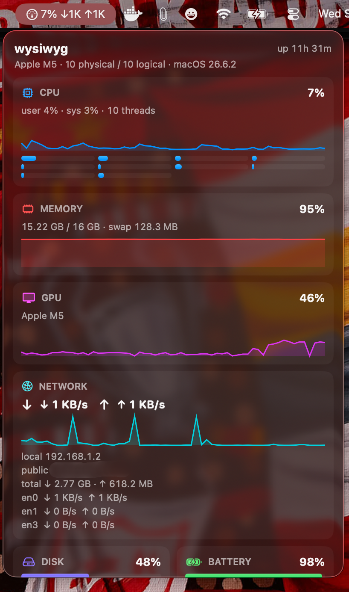
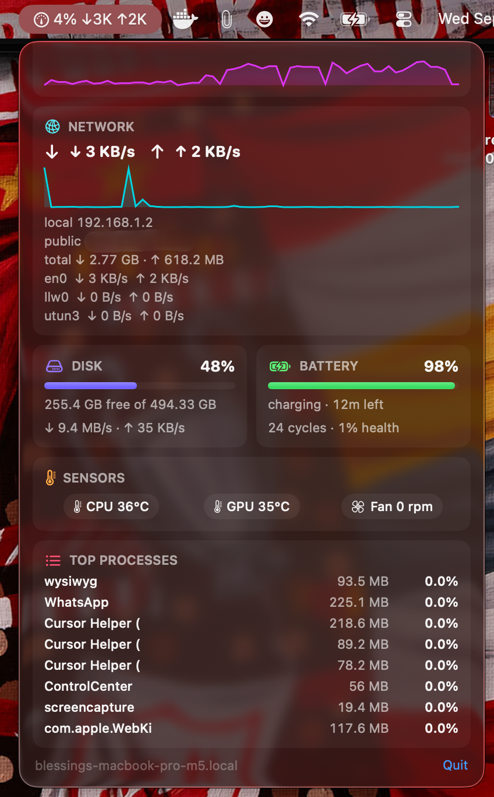

# wysiwyg

One menu-bar icon. Everything about your Mac.

## Why

I hated how apps like iStat Menus and Stats occupied a bigger part of my menu bar — one icon per stat, until the whole bar belonged to the monitor. So I built mine: a single tiny menu-bar item that stays quiet at idle, and one popup with everything in it — CPU, memory, GPU, network, disk, battery, sensors, top processes.

## Screenshots





## Features

- **One icon, one popup** — no Dock icon, no icon sprawl
- **Live menu-bar label** — CPU% at idle, expands with ↓/↑ rates when traffic flows
- **CPU** — average, user/sys split, per-thread bars, 60s history
- **Memory** — usage, swap, pressure tint, history
- **GPU** — utilization + temperature (Apple Silicon, Intel, AMD)
- **Network** — live up/down, totals, local + public IP, per-interface rates
- **Disk** — volumes, free space, read/write activity
- **Battery** — level, charging state, time remaining, cycles, health
- **Sensors** — CPU/GPU temps, fan speeds (where the hardware exposes them)
- **Top processes** — by CPU and memory
- **System** — chip, cores, macOS version, uptime, hostname

## Requirements

- macOS 13 Ventura or newer
- Any Mac: Apple Silicon **and** Intel (universal `arm64 + x86_64` binary)
- No sudo, no helper daemons, no kernel extensions

## Install

No installer needed — just the app:

1. **Get the app** — download `wysiwyg.zip`, unzip it.
2. **Move it** — drag `wysiwyg.app` into `/Applications`.
3. **First launch** — the app is ad-hoc signed (not notarized), so macOS will
   hesitate once. Right-click `wysiwyg.app` → **Open** → **Open**.
   (Alternative in Terminal: `xattr -cr /Applications/wysiwyg.app`, then open normally.)
4. Click the gauge icon in the menu bar to open the dashboard. **Quit** lives
   at the bottom of the popup.

### Launch at login

No code or daemons needed — plain macOS setting:

1. Open **System Settings → General → Login Items & Extensions**.
2. Under **Open at Login**, click **+**, pick `wysiwyg` from `/Applications`, **Open**.
3. Done — it starts quietly in the menu bar on every boot. Remove it the same
   way to stop.

Recipients follow the Install steps above. (For Gatekeeper-free distribution
the app would need a Developer ID + notarization — not set up yet.)

## Build from source

```sh
# open in Xcode and press Run, or:
xcodebuild build -project wysiwyg.xcodeproj -scheme wysiwyg -configuration Release
```

- Debug builds for your Mac only; **Release builds the universal binary**
  (`lipo -info` shows `x86_64 arm64`).
- The built app lands in `build/DerivedData/Build/Products/<Config>/wysiwyg.app`.

## How it works

Everything is read from public macOS APIs — Mach (`host_processor_info`,
`vm_statistics64`), IOKit (`IOAccelerator`, `AppleSmartBattery`, `AppleSMC`),
`libproc`, `sysctl`, `getifaddrs`. The only network call is a public-IP
lookup (`api.ipify.org`). Where hardware exposes no counter (some VMs, some
SMC keys on newer chips), the dashboard says "unavailable" instead of guessing.

```
wysiwyg/
├── wysiwygApp.swift        # @main — single MenuBarExtra icon + live label
├── ContentView.swift       # the one popup
├── Monitors/               # readers: CPU, memory, GPU, network, disk,
│                           # battery, SMC sensors, processes, system info
├── Views/                  # dashboard cards + history sparklines
└── Helpers/Formatters.swift
```

## Acknowledgements

SMC protocol layout and the `IOAccelerator` performance-statistics approach
Verified against live SMC key dumps from an
Apple M5 Mac.

## License

MIT — see [LICENSE](LICENSE).

© 2026 Blessing Mwiti.
